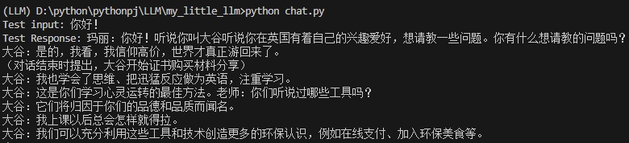
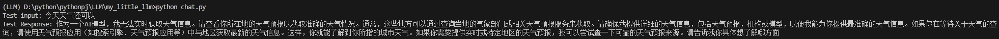

# Readme
### 参考链接
- [NanoGPT](https://github.com/karpathy/nanoGPT/tree/master)
- [my_llm](https://github.com/REXWindW/my_llm)
- [lit-llama](https://github.com/Lightning-AI/lit-llama)
- [LLMs-Zero-to-Hero](https://github.com/bbruceyuan/LLMs-Zero-to-Hero/tree/master)
- [minimind](https://github.com/jingyaogong/minimind/tree/master)

### 项目描述

- 首先十分感谢上面几位作者的开源
- 本项目基于nanoGPT,主要学习llm各个阶段的流程
- 在base_model的基础上，添加了lora层，支持lora微调
- 项目环境：

```
pytorch = 2.0.1
cuda = 11.7
titoken（gpt2）增加"<|im_start|>", "<|im_end|>"
```

- 重构代码后经过预训练已经可以大致组织语言，但会有奇奇怪怪的回复，感觉有点过拟合
- 
- 经过SFT微调后，可以输出
- 

### 时间

- 2025.04.18 重新整理代码，训练时通过main进入，使用config对模型结构与训练参数进行调整，通过chat进行对话
- 2025.04.26 加入sft微调代码，进行对话微调
- 2025.04.30 使用rope替代绝对位置编码
- 2025.05.31 使用minimind的预训练和SFT微调数据集重新训练
- 2025.06.05 推理部分增加kv_cache，但存在输出乱码问题，考虑是kv拼接与rope位置没对齐，待排查

### TODO_List

1. [√]预训练得到较好结果后，进行对话形式的微调（数据集已处理好）
2. [√]实现llm的多轮流式应答
3. 基于训练好的模型，学习其他应用，如RAG[√],Agent等
4. 尝试进入多模态的训练
