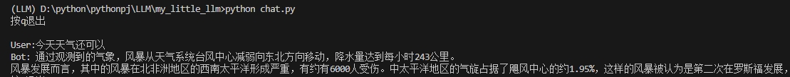

### 参考链接
- [NanoGPT](https://github.com/karpathy/nanoGPT/tree/master)
- [my_llm](https://github.com/REXWindW/my_llm)
- [lit-llama](https://github.com/Lightning-AI/lit-llama)

### 项目描述
- 首先十分感谢上面几位作者的开源
- 本项目基于nanoGPT,主要学习llm各个阶段的流程
- 在base_model的基础上，添加了lora层，支持lora微调
- 项目环境：
```
pytorch = 2.0.1
cuda = 11.7
titoken（cl100k_base）
```
- 当前经过预训练后暂时达到了胡言乱语的程度，但大致可以理通上下文的逻辑（存在乱码可能是因为分词的原因以及预训练数据集(wiki)没有得到较好清洗）
- 
- 新增预训练语料后，推理结果得到一定程度的改善，但依旧存在中文夹杂英文的情况，不确定是否是分词模型or分词数据集的问题
- 

### TODO_List
1. 预训练得到较好结果后，进行对话形式的微调（数据集已处理好）
2. 实现llm的多轮流式应答
3. 基于训练好的模型，学习其他应用，如RAG,Agent等
4. 尝试进入多模态的训练
